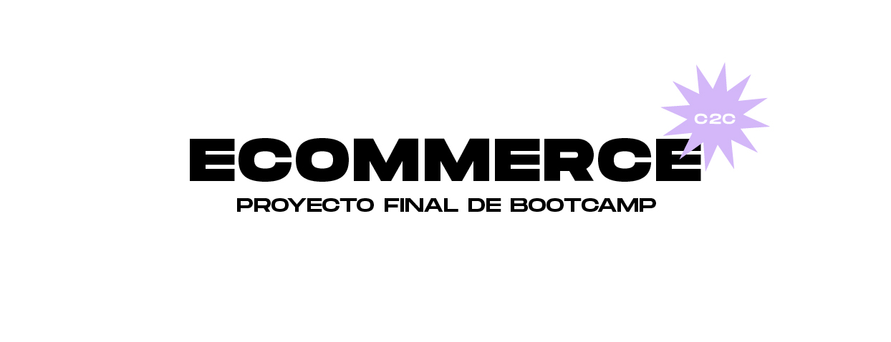

# E-commerce
REST API e-commerce that supports the CRUD operation of users and products


## Comenzando 🚀

Proyecto final donde se integran los temas vistos durante el curso. El desarrollo de la plataforma incorpora SpringBoot como framawork,

### Swagger

_Explica que verifican estas pruebas y por qué_

```
Da un ejemplo
```

## Construido con 🛠️


* [Spring] (https://start.spring.io/) - El framework web usado
* [Maven](https://maven.apache.org/) - Manejador de dependencias
* [MySQL](https://dev.mysql.com/downloads/workbench/) - Usado para manejar la base de datos


## Expresiones de Gratitud 🎁

* Emiliano Veloso por su pedagogia, conocimiento y paciencia 📢
* A mis compañeras que siempre estuvieron dispuestas a ayudar a quien lo necesitaba 
